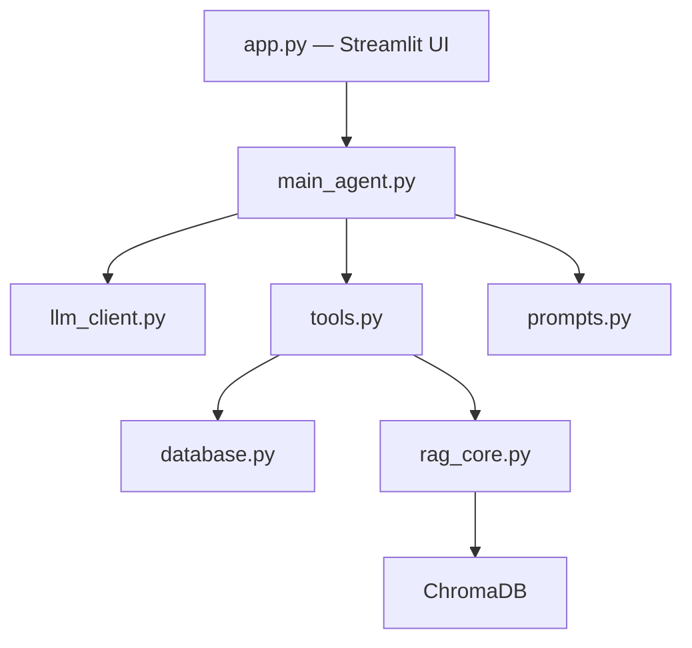

# JARVIS Acadêmico

> JARVIS Acadêmico é um chatbot que utiliza inteligência artificial para auxiliar estudantes em suas atividades acadêmicas. Com funcionalidades de agenda, gerenciamento de tarefas, busca de informações e suporte a estudos, o Jarvis visa facilitar a organização e o aprendizado dos usuários.

## Como executar o projeto:
Siga as instruções abaixo para rodar o projeto localmente, lembrando que é necessário ter o python e o Git instalados:

```bash
# 1. Clonar o repositório
$ git clone https://github.com/TheSherly/projeto_jarvis.git

# 2. Entrar na pasta do projeto
$ cd projeto_jarvis

# 3. Criar o ambiente virtual (venv)
$ python -m venv venv

# 4. Ativar o ambiente virtual
# No Windows:
$ venv\Scripts\activate
# No Linux ou macOS:
$ source venv/bin/activate

# 5. Instalar as dependências necessárias
$ pip install -r requirements.txt
```
🔑 Configurando as variáveis de ambiente: este projeto utiliza a API da OpenAI. Para que ele funcione, crie um arquivo chamado .env na raiz do projeto (onde está o requirements.txt) e adicione a sua chave de API:
```bash
GEMMA_BASE_URL=https://llm.liaufms.org/v1/gemma-3-12b-it
GEMMA_API_KEY=COLE SUA API KEY AQUI
```

Inicializando a aplicação: com o ambiente virtual ativado e a .env configurada, execute o comando abaixo para iniciar o Streamlit: 
```bash
$ streamlit run src/app.py
```

## Arquitetura do projeto (Modelo MVC):
```text
jarvis_academico/
│
├── data/                  # Pasta para o dataset com documentos de conteúdo acadêmico
├── vector_db/             # Pasta para armazenar os embeddings gerados localmente 
├── src/                   # Código-fonte principal
│   ├── app.py             # Interface do usuário (Streamlit) (View)
│   ├── database.py        # Interface com o banco de dados (Model)
│   ├── llm_client.py      # Interface com a LLM (Serviço de infraestrutura externa)
│   ├── main_agent.py      # Lógica principal do agente (Controller)
│   ├── prompts.py         # Prompts utilizados na LLM (Regras para tomada de decisão do agente)
│   ├── rag_core.py        # Lógica de RAG (Model)
│   └── tools.py           # Ferramentas utilizadas pelo agente (Padrão de projeto Strategy/Command)
├── jarvis_academico.bd    # Banco de dados SQLite para armazenamento de dados de agenda e tarefas
├── .env                   # Variáveis de ambiente
└── requirements.txt       # Dependências do projeto

```


## Tecnologias utilizadas
### No sistema:
- **Gemma 3 12B**: Modelo de linguagem de grande porte.
- **SQLite**: Banco de dados relacional.
- **Streamlit**: Framework para criação de interfaces gráficas.
- **Python**: Linguagem de programação.
- **Hugging Face Embeddings**: Para geração de embeddings.
- **Sentence Transformers**: Para geração de embeddings.
- **LangChain**: Framework auxiliar (via `langchain-text-splitters`) para divisão inteligente de textos.
- **ChromaDB**: Banco de dados vetorial utilizado para armazenamento e busca eficiente de embeddings.
- **PyPDF2**: Biblioteca para leitura e extração de texto em arquivos PDF.
- **python-dotenv**: Para gerenciamento de variáveis de ambiente.
- **openai**: Biblioteca base para comunicação com o modelo via API compatível.

### No desenvolvimento:
- **Gemini 3.1 Pro**: auxílio na correção de bugs e idealização do sistema.
- **Claude Sonnet 4.6**: auxílio no desenvolvimento e integração da interface gráfica.

## Como funciona:
O Jarvis Acadêmico foi desenvolvido baseado no padrão arquitetural MVC com adaptações para sistemas integrados com LLMs, sendo estendido com camadas de serviço e infraestrutura.  
### View 
O arquivo app.py (Streamlit) assume o papel de view e cuida única e exclusivamente da renderização visual, dos botões e do input do usuário.
### Model 
O database.py (SQLite) e o rag_core.py (ChromaDB) ditam as regras de como salvar uma tarefa e de como buscar o contexto nos PDFs. Eles não sabem que existe uma tela e não conversam direto com o usuário.
### Controller 
O main_agent.py é o orquestrador central. Ele recebe a requisição da View, processa a lógica de decisão e aciona o Model com o auxilio das camadas de serviço e infraestrutura.
### Camadas de serviço e infraestrutura.
`prompts.py` são dados de configuração do Controller (as regras de tomada de decisão do seu agente).  


`llm_client.py` é um serviço de infraestrutura externa que faz a ponte entre o Controller e a LLM.   


`tools.py` funciona como uma camada de abstração que combina os conceitos de Command e Strategy, já que fornece ao Agente de IA uma família de algoritmos intercambiáveis para resolver a intenção do usuário (seja buscando no banco relacional ou no banco vetorial) e encapsula essas ações em "métodos" padronizados que o Agente pode invocar dinamicamente via Function Calling."

### Lógica do RAG (Retrieval Augmented Generation)
O RAG é o motor que permite ao JARVIS ler, compreender e consultar os seus materiais de estudo. O funcionamento deste sistema no projeto divide-se em duas grandes fases: a Preparação (Indexação) e a Consulta (Busca).

#### Indexação
1. **Extração de Texto (PyPDF2)**: O sistema abre cada documento PDF e extrai todo o texto bruto contido nele, ignorando imagens e formatações complexas.
2. **Chunking**: Como a IA não consegue ler um livro inteiro de uma só vez, o texto extraído é cortado em pequenos pedaços (chunks) usando o `RecursiveCharacterTextSplitter`. O sistema cria sobreposições(overlap) entre esses pedaços (ex: o final do trecho A é o início do trecho B) para garantir que nenhuma frase ou contexto seja cortado ao meio. Dentro do arquivo `rag_core.py`, pode-se configurar o tamanho do chunk e o overlap, em que definimos o tamanho do chunk em 500 caracteres e o overlap em 50 caracteres, essa quantidade de chunks, juntamente com os overlaps garantem que nenhum contexto seja cortado ao meio e afete na resposta dada pela llm.
3. **Transformação matemática em Embeddings (all-MiniLM-L6-v2)**: O modelo Hugging Face (`all-MiniLM-L6-v2`) lê cada pequeno trecho de texto e converte-o numa coordenada matemática (um vetor de 384 dimensões). Textos com significados parecidos (ex: "cachorro" e "cão") recebem coordenadas muito próximas.
4. **Armazenamento vetorial**: Estas coordenadas e os textos originais são guardados num banco de dados especial chamado ChromaDB.

#### Consulta
5. **Transformação matemática da pergunta (Embeddings)**: Quando você faz uma pergunta, o sistema primeiro a transforma em coordenadas matemáticas usando o mesmo modelo (`all-MiniLM-L6-v2`).
6. **Busca por similaridade**: O ChromaDB calcula a "distância", por meio de similaridade de cosseno, entre a coordenada da sua pergunta e as coordenadas de todos os trechos de PDFs guardados. Ele seleciona os 3 ou 4 trechos matematicamente mais próximos (ou seja, os parágrafos do PDF que contêm a resposta).
7. **Geração Aumentada**: Os trechos de texto recuperados são enviados para a IA (Gemma 3 12B) junto com a sua pergunta original. A instrução oculta é: "Responda à pergunta do usuário baseando-se ESTRITAMENTE nestes trechos do material de estudo".
8. **Geração da Resposta**: O JARVIS processa essa informação e responde no chat de forma natural, precisa e fundamentada exclusivamente no seu próprio material, citando as fontes.


### Funcionalidades:
| Tool | Função |
| ---------- |  ---------------- |
| consultar_agenda  | Busca e lista todos os eventos acadêmicos que estão programados dentro de um intervalo de tempo específico. |
| listar_tarefas  | Varre o banco de dados e exibe o seu painel de estudos. Possui a inteligência de filtrar as tarefas, permitindo que a IA mostre apenas o que você ainda precisa estudar ou o que já foi finalizado. |
| adicionar_tarefa   | Cria uma nova atividade na sua lista de afazeres. O grande diferencial desta ferramenta é a capacidade de vincular a tarefa de estudo diretamente a um evento da sua agenda |
| concluir_tarefa   | Dá o "check" de finalização em uma atividade. A IA utiliza o número de identificação exato da tarefa para marcá-la como concluída no banco de dados. |
| buscar_material_rag  | Quando você faz uma pergunta sobre a matéria, a IA aciona esta ferramenta para vasculhar o banco de dados vetorial, extraindo os trechos mais relevantes diretamente dos seus PDFs e materiais de estudo indexados. |


### 📝 Andamento do projeto - checklist:
- [x] Consulta a materiais de estudo (RAG)
- [x] Agenda acadêmica
- [x] Lista de tarefas
- [] Planejamento de estudos
- [x] TOOL CALLING
- [] Melhorias de aprendizado com funcionalidade interativa
- [] Avaliação do sistema com 10 perguntas
- [] Análise de erros: Identificar 3 falhas
- [x] Construir dataset e incluir origem, tipo e limitações dos dados
- [x] Separação de responsabilidades
- [x] Logs para monitoramento e debug
- [x] Tratamento de erros e exceções 
- [x] Integração com LLM
- [X] Listar ferramentas usadas no README
- [x] Interface gráfica